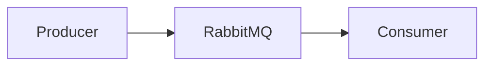
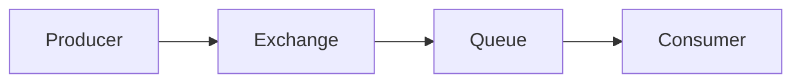
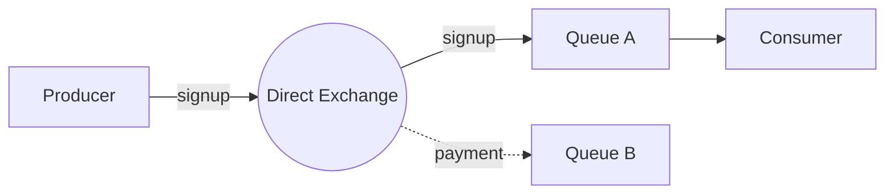
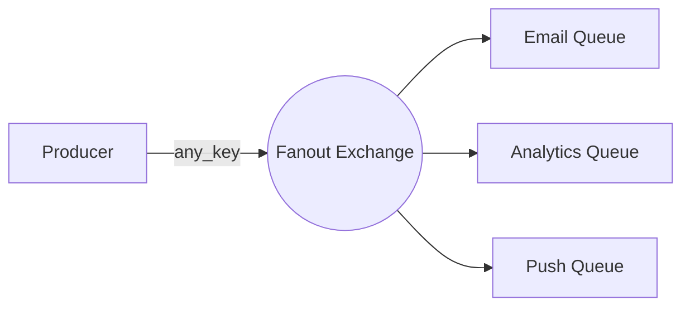
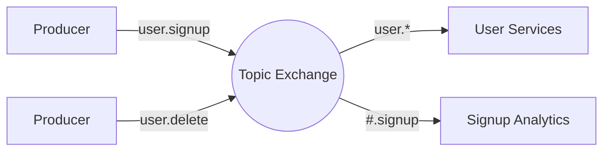
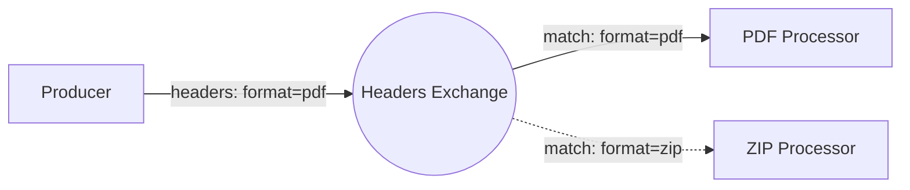
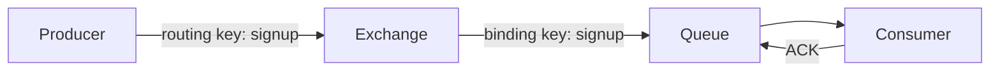

# Concept

RabbitMQ is a **message broker** that enables **asynchronous communication** between applications.

Instead of services communicating directly with each other, they communicate through a broker that **receives, stores, and forwards messages** between producers and consumers.

RabbitMQ follows the messaging model:

```

Producer → Exchange → Queue → Consumer

````

```mermaid
graph LR
P[Producer] --> E[Exchange]
E --> Q[Queue]
Q --> C[Consumer]
````

This architecture allows systems to communicate **without being tightly coupled**.

---

# Problem It Solves

In traditional systems, services communicate directly using protocols such as HTTP.

```mermaid
graph LR
A[Service A] -->|HTTP Request| B[Service B]
```

While this works for many cases, it introduces several problems.

### Tight Coupling

The sender must know the receiver’s address and availability.

### Synchronous Processing

The sender must wait for the receiver to respond.

### Failure Propagation

If the receiver is down, the request fails immediately.

### Traffic Spikes

If too many requests arrive at once, the receiving service may become overloaded.

---

RabbitMQ solves these problems by introducing **asynchronous message buffering**.



Messages are stored in queues until they are processed, allowing services to operate **independently**.

---

# Architecture

RabbitMQ sits between services and manages message delivery.



### Message Flow

1. A **producer publishes a message** to an exchange
2. The **exchange routes the message** to one or more queues
3. The **queue stores the message**
4. A **consumer retrieves and processes the message**
5. The consumer sends an **acknowledgement**

---

# Components

## Producer

A **producer** is an application that sends messages to RabbitMQ.

Example message:

```json
{
  "event": "user_signup",
  "user_id": 123
}
```

The producer publishes messages to an **exchange**, not directly to queues.

---

## Exchange

An **exchange** receives messages from producers and determines how they should be routed to queues.

Routing decisions are based on:

* **routing key**
* **binding key**
* **exchange type**

---

## Queue

A **queue** stores messages until they are processed by a consumer.

Queues provide **buffering** and ensure that messages are not lost if the consumer is temporarily unavailable.

---

## Consumer

A **consumer** retrieves messages from a queue and processes them.

Examples of tasks handled by consumers:

* sending emails
* processing payments
* generating analytics events

---

## Binding

A **binding** connects an exchange to a queue.

Bindings define the routing rules used by the exchange.

Example:

```
Exchange: user_events
Queue: email_service
Binding Key: user.signup
```

---

# Exchange Types

RabbitMQ supports **four types of exchanges**, each defining how messages are routed.

---

## Direct Exchange

Routes messages to queues where the **routing key exactly matches the binding key**.

Example:

```
routing key: signup
binding key: signup
```



---

## Fanout Exchange

Broadcasts messages to **all bound queues**, ignoring routing keys.

Useful for **event broadcasting**.

Example:

```
user.signup event
→ email service
→ analytics service
→ notification service
```



---

## Topic Exchange

Routes messages based on **pattern matching**.

Example routing keys:

```
user.signup
user.delete
order.created
```

Example binding pattern:

```
user.*
```

Wildcards allow flexible routing.



---

## Headers Exchange

Routes messages based on **message headers** instead of routing keys.

This exchange type is less commonly used.



---

# Message Flow

A typical message flow in RabbitMQ:



### Steps

1. Producer sends a message with a **routing key**
2. Exchange receives the message
3. Exchange routes the message to matching queues
4. Consumer retrieves the message
5. Consumer processes the message
6. Consumer sends an **acknowledgement**
7. Queue removes the message after acknowledgement

---

# Reliability Mechanisms

RabbitMQ provides several mechanisms to ensure reliable message delivery.

---

## Message Acknowledgement

Consumers acknowledge messages **after processing**.

### Auto Acknowledgement

The message is acknowledged immediately after delivery.

Risk: if the consumer crashes before processing the message, it is **lost**.

---

### Manual Acknowledgement (Recommended)

The consumer explicitly acknowledges the message **after processing completes**.

If the consumer crashes before acknowledging, the message is **returned to the queue**.

This ensures **at-least-once delivery**.

---

## Durable Queues

Queues can be configured as **durable**, meaning they survive broker restarts.

---

## Persistent Messages

Messages can be marked as **persistent**, ensuring they are written to disk.

---

## Dead Letter Queues (DLQ)

Messages that repeatedly fail processing can be routed to a **dead letter queue** for inspection or retry.

---

# Use Cases

RabbitMQ is commonly used for the following patterns.

---

## Background Jobs

Examples:

* sending emails
* generating reports
* video processing

---

## Microservice Communication

Services communicate using events.

Example:

```
order.created
payment.completed
shipment.dispatched
```

---

## Event-Driven Systems

Multiple services can react to the same event.

Example:

```
user.signup
```

Possible triggers:

* welcome email
* analytics tracking
* notification service

---

## Traffic Buffering

Queues absorb **traffic spikes**, allowing workers to process messages at a steady rate.
