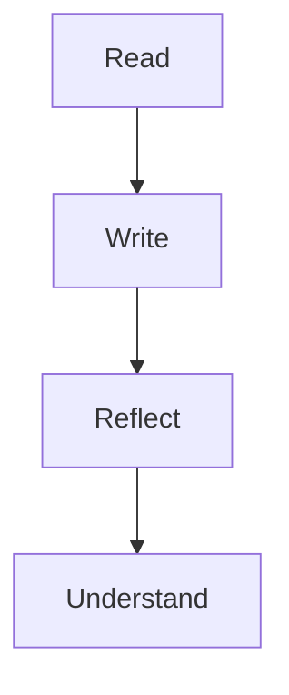

# useEffect in practice

`useEffect` is for syncing your component with the outside world: network requests, subscriptions, browser APIs, and timers.

## Reliable mental model

1. Render describes UI.
2. Effect runs after paint.
3. Cleanup runs before re-running effect or unmount.

## Pitfall to avoid

Avoid treating `useEffect` as a place for derived state that can be computed during render.

## Example

```tsx
useEffect(() => {
  const timerId = window.setInterval(() => {
    console.log('heartbeat')
  }, 1000)

  return () => {
    window.clearInterval(timerId)
  }
}, [])
```

## Reference link

[Watch related notes on YouTube](https://www.youtube.com/@shakthisagar)

## Inline image preview


## YouTube iframe embed

<iframe
  src="https://www.youtube.com/watch?v=dQw4w9WgXcQ"
  title="Sample YouTube Embed"
  loading="lazy"
  allowfullscreen
></iframe>

## Mermaid support


