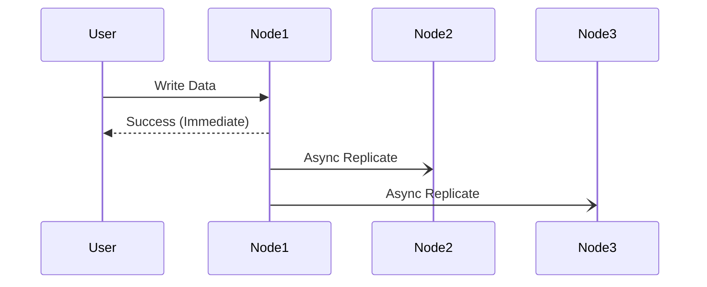
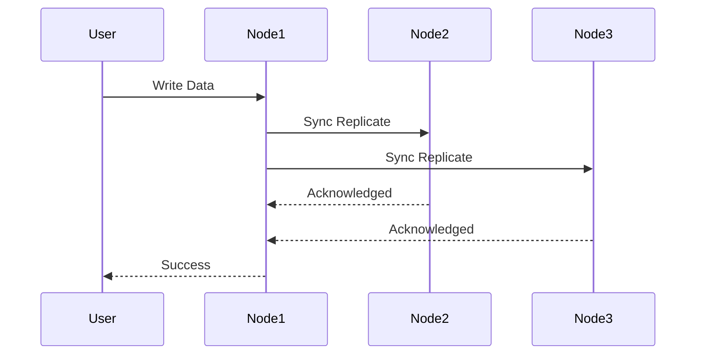

# Consistency Patterns

Consistency Patterns refers to the way in which data can be stored and managed in a distributed system, and how its made available to the users and applications.

There are 3 patterns, each with their tradeoffs:

* Strong Consistency
* Weak Consistency 
* Eventual Consistency

---

## Weak Consistency

After a write operation, it is not guaranteed that the subsequent read operations will reflect the updated data. This may or may not reflect it. 

This ensures high availablity and low latency.

Games like Valorant, where a enemies movement update can be missed due to network issues, but the game still continues. 

---

## Eventual Consistency

This is a form of Weak consistency. After a write operation, the change will be eventually reflected in the subsequent read operation, as the asynchronus data replication happens.

This too ensures high availablity and low latency, but there can be inconsistencies between 2 versions of data.

Social media post likes and comments are the best example for this, where 2 people can possibly see different like count at the same time, but after refreshing it will consistent for both.

---

## Strong Consistency

After a write operation, the change is replicated to all the nodes so the subsequent read requests will immediately get the updated data. This ensures all users get the same data at all the time. Its either latest data or no data at all (failing the request or timeout)

This leads to consistent data, but higher latency and low availablity.

Data critical systems like banking and financing, where atomic write operations are to be reflected to everyone.
