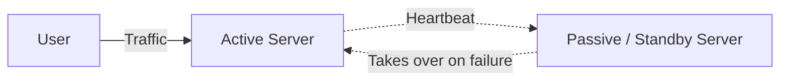
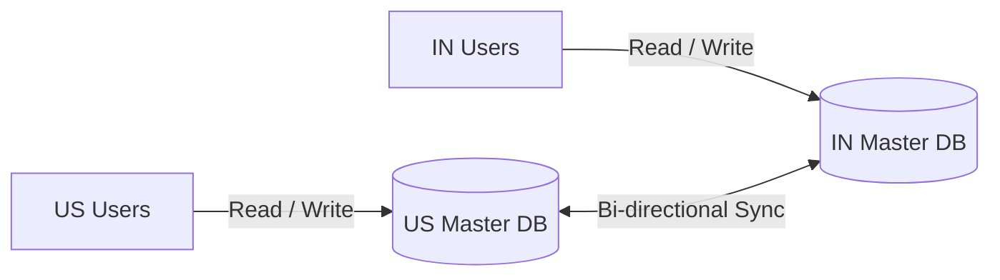
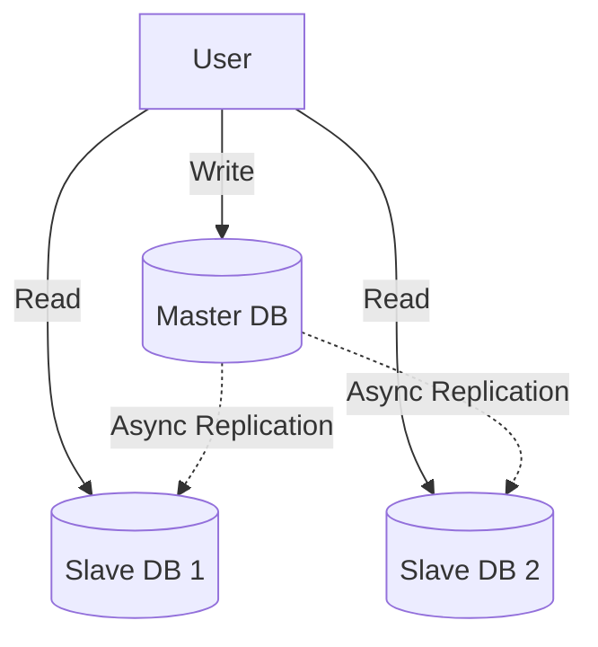

# Availability Patterns

These are architectural approached used to ensure the system remains operational and can service users even in times of failures. These focus on minimizing downtime and maintaining a consistent service by incorparating redundancy, fault tolerance and recovery mechanisms into the system's design.

Types:

* Fail-Over
* Replication

---

## Fail-Over

Ensures system survives. 

There is a primary component and a standby component. When the primary component fails or stops responding, the standy component is used to respond to the user requests this way , the system's availablity is ensured.

Types:

* Active-Passive
* Active-Active

---

### Active-Passive

One server is active while other in passive i.e on standby. Heartbeats are sent between active to passive regularly. In case of failure, the heartbeat is interrupted, causing the standby server to take over the IP address and continue service.

Downtime depends on if the standup server is start from a cold state or if it was already running in hot standby. 

Only the active server handles traffic.

Example:

Consider Amazon RDS, primary db handles all read writes, while the standby db just replicates all data. When the primary db fails, the standby will take over as the active one.

---

### Active-Active

Both server are actively responding to the user requests. Incase of failure of one server, the other server will take responsiblity of answering for the other's requests as well.

But in this, data sync between the 2 servers must be ensures. Can also lead to conflicts when 2 servers attempt an action on the same resource at the same time. 

---

## Replication

Ensures data survives.

This pattern involves having multiple copies of the same data stored at different locations, so that in case of failure, the data can be retrived from the other locations. 

Types:

* Master-Master Replication
* Master-Slave Replication

---

### Master-Master Replication

2 servers, both configured as masters. Both accept read and write operations. This gives high availablity as the other server can take over in case a failure. But issue if the same data is updated at the same time, these conflicts will need to be handled.

Multi region db, like US and India both handle their own requests. Now if US db fails, India db will start responding to the US server requests. This will ensure the users are still serviced, though with a bit of increased latency.

---

### Master-Slave Replication

One server is master and other is slave. Master handles all the write operations, while the slaves handle the read operations. In case of a failure the slaves are promoted to master. Simpler than the Master-Master pattern to setup.

MySQL db, where master handles all the writing, while slaves answer the write operations. 
