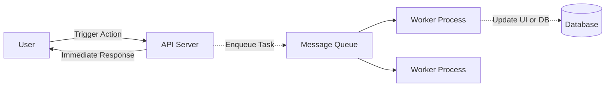

# Background Jobs

These are tasks that are executed in the backend, independant from the main execution flow of the system. Most often initated from the system itself, rather an a user or a external agent.

Used for purposes like, processing large volume for data during import or export, maintenance jobs like cleaning up old data, long running computations like data analysis etc.

These are tasks which you dont want to make the user wait for to complete, instead the user is notified when the task is completed.

Types:

* Event Driven - Triggered by a event. Example, user creates an account, this triggers an event that will start a background job to setup all the details for the account.

* Schedule Driven - Triggered periodically or at a set time. Example, getting analytics on user interactions for the day at 12 am midnight.

These are usually fire and forget operations. So their execution has no impact on the caller process or UI. They dont expect the caller to hold for the results. Instead the caller is usually given a unique-id to check on the progress of the job and upon completion same can be used to check the results.
